# Hopper + lldb for iOS Developers: A Gentle Introduction

Lately I've seen a lot of people asking "How are you getting that pseudo-code," in regards to [@steipete's radar](http://www.openradar.me/19067761) he filed and I thought this would be a great first blog post of mine as I've been wanting to for awhile. I spend a lot of my time in a tool called Hopper (it's a must have in my toolbox) and while it's an amazing tool, it can seem overwhelming at first. The goal of this post is to bridge the gap for those that have shied away or aren't familiar with reverse engineering.

Have you ever wondered how people get pseduo-code of some private API like the image below? It's actually very simple and is a great way to chase down those annoying bugs in UIKit or some other binary you don't have source code for. Getting this pseudo-code can literally be accomplished in just a couple clicks with a tool such as Hopper. What's even cooler though, is we don't have to stop there. With the Obj-C runtime and lldb we can make the pseudo-code even more readable if not syntactically correct! So let's dive in!

###### Decompilation of a method in UIKit.
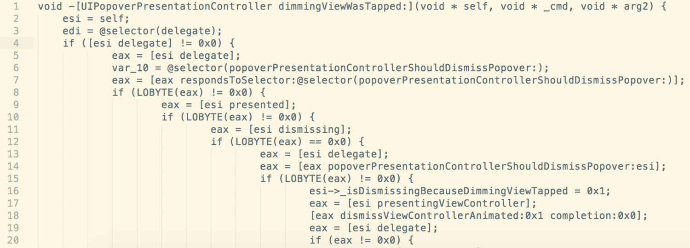

## What is Hopper?

Straight from the [Hopper home page](https://www.hopperapp.com/), *"Hopper is a reverse engineering tool for OS X and Linux, that lets you disassemble, decompile and debug your 32/64bits Intel Mac, Linux, Windows and iOS executables!"* Translated to more general terms, this means we can take a compiled binary (your iOS app, UIKit binary, etc) and produce this pseudo-code you've seen!

### Disassembly vs Decompilation

What's the difference between disassembly and decompilation? Very simple, disassembly (accomplished via a disassembler) is the process of converting opcodes (the raw bytes of your binary) to their corresponding assembly instruction (also known as mnemonics). The picture below show a method that was disassembled. Decompilation (accomplished via a decompiler) is the process of converting this assembly to the pseudo-code. See before and after below.

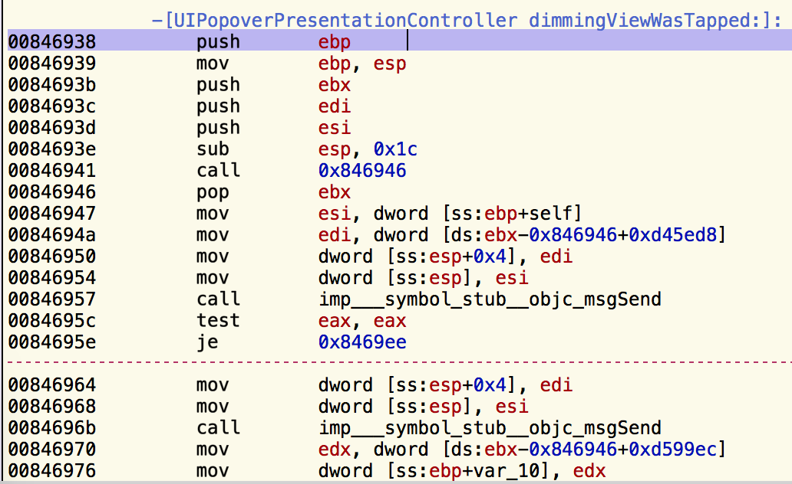
###### Disassembled


###### Decompiled

At the time of this post, you can purchase Hopper for only $90 bucks, which is an absolute steal. For those that understand the power of this tool, know that it could easily sell for a couple hundred bucks, so if you think it's expensive, think again! They also provide a _free_ demo version which has some limitations, but should be fine if you want to follow along.

### Getting Started

Once you have Hopper downloaded and installed, open it up and click the **"File -> Read Executable to Disassemble..."**.

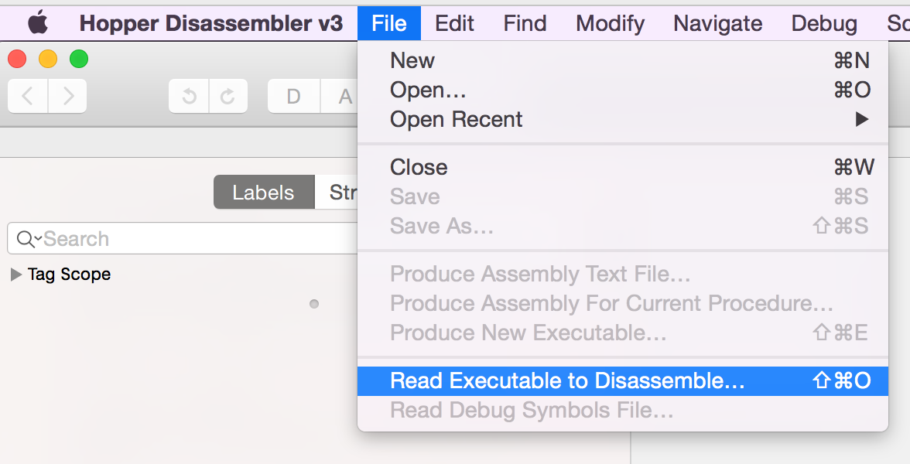
###### Click Read Exectuble to Disassemble to start disassembling.

At this point, you need to grab your binary of interest and click **"Open"**. In this walkthrough, we will be looking at the UIKit binary which can be found at:

```
</Applications/Xcode.app/Contents/Developer/Platforms/iPhoneSimulator.platform/Developer/SDKs/iPhoneSimulator8.1.sdk/System/Library/Frameworks/UIKit.framework
```
You may need to update some directory names, but that gets you in general direction. This is the x86 binary that the simulator uses and what we will be focusing on. The ARM binaries are stored on the device and loaded at runtime. After clicking open, you will be presented with window below. UIKit is a _FAT_ binary meaning it contains multiple binaries within itself. In the UIKit case, x86 32 and 64-bit slices. We're going to disassemble the 32-bit slice. Make sure it's selected and click **"Next"**. 

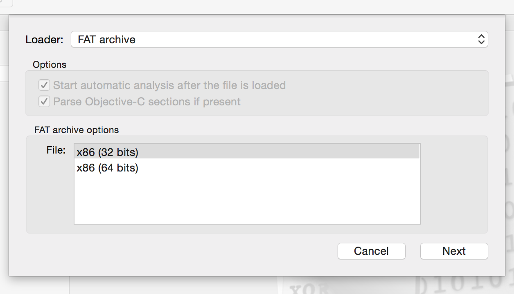
###### Notice the x86 (32 bits) and x86 (64 bits) slices.

Click **"OK"** on the next screen and you will be dropped into Hopper's main window. Hopper will begin analyzing the Mach-O binary, and during this time, you will see a _"Working..."_ status in the bottom right. Let it finish, and since UIKit is a large binary, it will take some time. For smaller binaries it's fairly fast. Now, if it looks cryptic to you, don't panic, we're only going to focus on three buttons in the entire window.

First up is the _"Labels"_ and _"Strings"_ tabs in the left hand panel. _"Labels"_ will show you all of the classes and methods in your binary (you'll see other things as well, but just pay attention to method signatures for this tutorial).

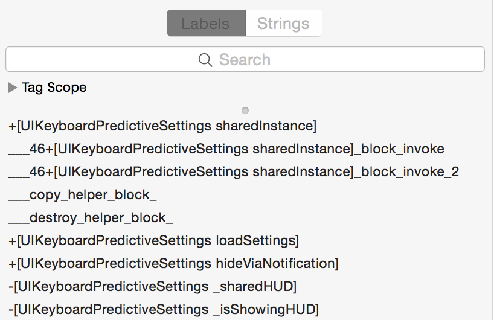
###### Scroll down and look at all the methods!

Now click on the _"Strings"_ tab in the left handle panel and this will show you all of the strings in your app. Hence why you should never hardcode important strings in your apps.

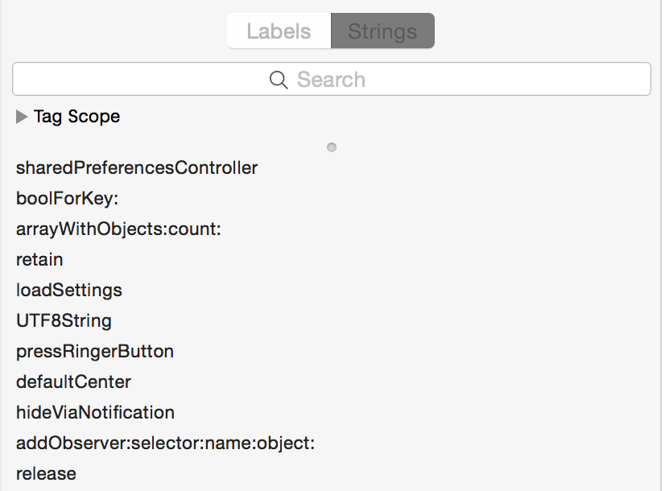
###### Check your own apps to make sure you haven't hardcoded anything you don't want other to see!

### Prepare yourself

Switch back to the _"Labels"_ tab and notice the search field. Here you can search for any class and method name. Type **"UIPopoverPresentationController dimmingView"** and notice the results. Click on the **"-[UIPopoverPresentationController dimmingViewWasTapped:]"** signature and notice the main window jump to the disassembly of _"-[UIPopoverPresentationController dimmingViewWasTapped:]"_.

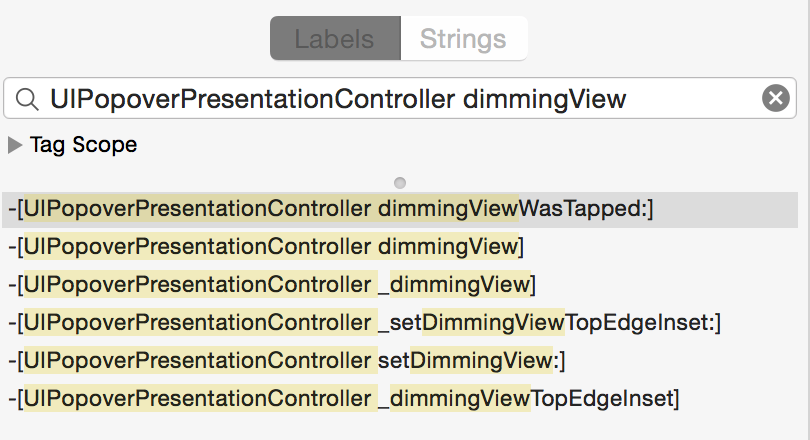
###### Search for method names and classes

Unless you know your assembly, this view is not much help, so look in the upper right hand corner and notice the button with some code on it. This is the button that kicks off the decompiler and produces pseudo-code. **Click it!**

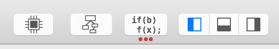

Not so bad after all huh?? 

This is _very powerful_ when debugging 3rd party SDKs or are interested in looking at your own apps.

My general workflow when trying to track down a bug is such:

1. Find method in my code that I think is causing the issue and then fire up Hopper
2. Search for that class + method name and decompile
3. From the decompilation, I can easily gather method signatures and set the breakpoints on them in lldb (see the lldb section).

That's literally it, nothing less, nothing more. You can stop here if you want, but I've added a _lldb_ section for a deeper dive into my workflow for cleaning up the pseudo-code even more!

### lldb

To get started, download the sample project provided by [@steipete](https://twitter.com/setipete) in a recent [radar](http://www.openradar.me/19067761) he filed. Once the project is open, I generally like to set my Debug Architecture to **"$(ARCHS_STANDARD_32_BIT)"** as it makes the assembly a little bit more friendly (this is assuming I decompiled the 32-bit slice from a given binary).

#### Setting breakpoints on private methods

Alright,  so the pseduo-code produced from Hopper will generally suit your needs, but there's time it's a bit cryptic and needs some cleaning up. This is where the Obj-C runtime and lldb come into play, so let's get started.

First things first, let's fire up the sample project in the _simulator_ and pause the program execution via the debug area. After pausing, you will be dumped into lldb where you can set breakpoints on any method signature you'd like. Set one on _"-[UIPopoverPresentationController dimmingViewWasTapped:]"_ by typing **"b -[UIPopoverPresentationController dimmingViewWasTapped:]"** followed by enter. Your debug console should look similar to the image below.

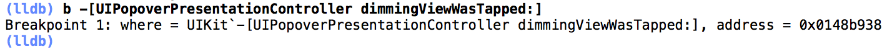
###### b is shorthand for setting a breakpoint

Now continue program execution and if _"-[UIPopoverPresentationController dimmingViewWasTapped:]"_ is ever fired, your breakpoint will be hit. Follow the instructions in the sample project (double tap in the yellow area).

If everything worked, you should see the breakpoint was indeed hit and you're now presented with the method signature and corresponding assembly. Just for kicks, compare the disassembly in Xcode to what Hopper produced. They're probably very similar looking. If there is a difference, it may be because one's using [Intel syntax whereas the other AT&T](http://en.wikipedia.org/wiki/X86_assembly_language). See the _Other_ at the end of this post if you're seeing something else.

At this point you may be a bit worried because you don't know assembly, but I'm here to tell you that you _really_ don't need to. With a little intuition and trial-n-error you can make enough since to get the job done. So to reiterate, all we're going to be doing here is making the decompilation a little less cryptic (replacing registers etc). This pseduo-code happens to not be so cryptic, but when you run into cases where it is, the same concepts can be leveraged to clean it up.

Alright, now's the time to look at the disassembly and decompilation side-by-side. What I typically like to do is look for _key-points_ in the decompilation such as if statements and methods being called. The corresponding assembly for these key-points is fairly easy to guess just by scanning the assembly line-by-line. If your key-point is an if statement look for a _test_ or _cmp_ (compare) instruction.

In this case, I'm going to choose the first if statement in the decompilation and search the dissassembly in Xcode for a test or cmp instruction. As you can see in the image below, I found a test instruction.

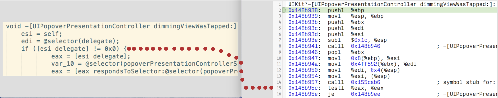
###### This can be trial-n-error when first getting started, but have patience!

Now let's set a breakpoint on that memory address (your address may differ) via **"b 0x148b95c"**.

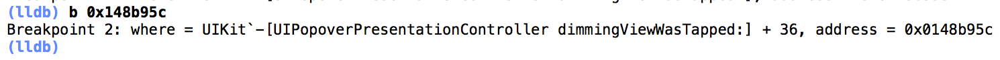

Continue program execution and hopefully your breakpoint will be hit.

This next step is where lldb and the Obj-C runtime make things really nice. We're going to clean up most of the cryptic lookingness from the decompilation. For those that aren't familiar with what _eax_, _edi_, and _esi_ are in the decompilation, they are x86 CPU registers and we can dump them in lldb. If you see _r0_, _r1_, _r16_, etc that's the ARM architecture. If that doesn't make since to you, don't worry just know to match them up with your pseudo-code.

Type **"register read"** at the lldb prompt and press enter.

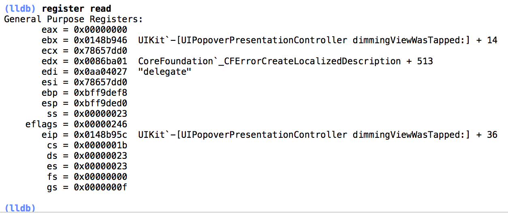
###### CPU registers. The names vary depending on your current architecture.

The output is the CPU registers and their values. You can now substitute the registers in the decompilation with the values seen in lldb output.

Don't blindly go replacing esi, edi, and other registers throughout your decompilation, as they maybe different values after different code executes. This goes back to choosing key-points wisely. My workflow is this:

1. Set a breakpoint on a key-point, continue exectution
2. Dump registers
3. Substitute the registers in the decompilation **above** our _key-point_ with the values in lldb output

For example, our key-point was the first if statement in the dimmingViewWasTapped method, once the breakpoint was hit, dump register and replace the registers **above** the if statement in the pseudo-code. If you follow the pseudo-code and see the registers haven't been reset _after_ your key-point, then by all means update those values as well.  

If you go ahead and try this, you will notice that edi contains the delegate selector, but the esi register contains a hex value. This is more cryptic if anything, but luckily we can take advantage of the Obj-C runtime and figure out what esi really is.

Copy the memory address out of esi and type **"po [0x78657dd0 class]"** and press enter.

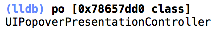
###### Very nice!

Walah, we now know what esi is and can update the decompilation with this value. 

I realize that the decompilation says _"esi = self"_ and some of you already inferred that esi == UIPopoverPresentationController, but that won't always be the case. Also, if it's not apparent yet, you can do things like _"po [0x78657dd0 anyMethodThatThisClassImplements]"_. Very powerful when curious about the internal state of an object.

At this point, it's just an iterative process of picking a new key-point and repeating, so with that said, I think it's best to keep this short and sweet! If you have any questions or feedback, ping me on twitter [@bartcone](https://twitter.com/bartcone).

Bart

### Other
Are there any alternatives to Hopper?

 - Yes, there's IDA Pro (HexRays is their decompiler), but unless you want to fork out thousands of dollars, Hopper is your best bet. They have a free version, but it's only the disassembler.

My decompilation or disassembly is showing registers with r's instead of e's

- You have either disassembled or decompiled the x86_64 slice.